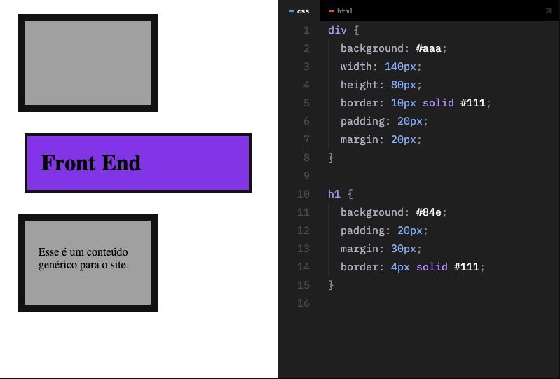

# Curso HTML e CSS Básico - Origamid

Repositório para estudos e criação de sites utilizando os conhecimentos de HTML e CSS pela plataforma Origamid

## :pencil2: Introdução: HTML e CSS

### 1. TAG

As tag's (etiquetas) servem para marcarmos o conteúdo no HTML. Geralmente abrimos <a> e fechamos </a> após o conteúdo. Case insensitive, mas é boa prática escrever com minúsculas <html>.

### 2. Atributo

```js
<a href="https://wwww.google.com">Google</a>
```

### 3. Conteúdo

As tags servem para inserirmos conteúdos como textos, imagens, vídeos e outros. Além da dar informações para o browser como o título do site, linguagem e outras.

### 4. Semântica

Dar sentido ao conteúdo, a escrita de um documento semântico beneficia principalmente leitores de tela (acessibilidade) e leitores de códigos (robôs como o do Google).

### 5. Interação com CSS e Javascript

Através das marcações das tags que conseguimos selecionar elementos para mudarmos o seu estilo ou comportamento.

### 6. Link Caminhos

**Absoluto**

```js
<a href="https://www.origamid.com/cursos/">Origamid Cursos</a>
```

Usado para arquivos externos ao nosso site.

**Relativo**

```js
<a href="/produtos/bicicletas.html">Bicicletas</a>

Usado para arquivos internos do site.
```

### Links

**link**

- Cria uma relação entre um documento HTML e um arquivo de estilo CSS.

**rel**

- Define o tipo de arquivo (stylesheet para CSS). É possível linkar outros também como favicons.

**href**

- Define o caminho do arquivo.

```js
<link rel="stylesheet" href="/style.css" />
```

Exemplo

```js
a {
  color: black;
  text-decoration: none;
}
```

### Introdução: Javascript

1. Javascript
   Javascript é uma linguagem de programação.

- Altera o comportamento do documento: utilizado para modificar o estilo, criar galerias de imagens, observar as ações do usuário, puxar informações de outros sites, manipular dados e mais.

2. js
   Arquivo de texto simples terminado em .js

```js
function mudar() {
  texto.style.color = "red";
}
texto.addEventListener("click", mudar());
```

Exemplo

```js
<h1 id="texto">Olá mundo</h1>
<style>
  h1 {
    color: black;
  }
<style>

<script>
function mudar() {
  texto.style.color = "red"
}

texto.addEventListener("click", mudar);
</script>
```

### Box Model

- **Content** (conteúdo): Define a largura inicial da caixa (salvo elementos de bloco)
- **Padding** (preenchimento): Separa o conteúdo das bordas da caixa. É a margem interna.
- **Border** (borda): Define bordas para a caixa
- **Margin** (margem): Define a distância entre uma caixa e outra
- **Width** (largura): A largura total da caixa, por padrão é o somatório do conteúdo + padding (left/right) + border (left/right).
- **Height** (altura):A altura total da caixa, por padrão é o somatório do conteúdo + padding (top/bottom) + border (top/bottom).


### div

A div é um elemento de bloco **block** genérico que serve para auxiliar no posicionamento dos elementos/conteúdo na tela.
Existem também elementos semânticos como main, section, nav e outros.



### Display inline e block

Define como a caixa (box model) irá se comportar.

**inline**: Respeita o fluxo da escrita sem iniciar uma nova linha, não é possível definir valores de **width**, **height** e **margin** (top/bottom) e etc. É o estilo **padrão**.

**block**: Inicia uma nova linha e não permite que outros elementos sejam posicionados em sua linha. Aceita todas as propriedades do box model. Estilo inicial de elementos como **h1**, **p**, **div** e outros.
